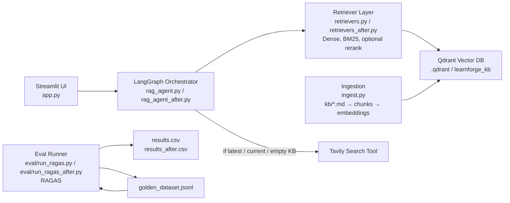

# LearnForge: An Agentic RAG Learning Architect

## Task 1: Defining Problem, Audience, and Scope

### 1.1 Problem Statement (2 pts)

Learners and researchers consume large volumes of learning material from various sources but lack a structured, retrieval-driven system that allows them to query, evaluate, and iteratively improve their understanding using measurable feedback.

### 1.2 Why Is This a Problem for Your Specific User? (5 pts)

The target user is any aggressive learner or researcher actively studying or researching topics. Over weeks of study, they accumulate markdown notes, notebooks, diagrams, technical summaries, and web searches. However, this information remains fragmented and manually searchable. When preparing for an exhaustive report, building production systems, or revisiting previous learnings, they rely on keyword search or memory rather than semantic retrieval.

The deeper issue is the absence of an evaluation loop. Even if they build a RAG system over their notes, they typically do not measure context recall, faithfulness, or precision. As a result, improvements are intuitive rather than data-driven.

**LearnForge** solves this by:

- Indexing personal learning materials
- Retrieving relevant context
- Generating grounded responses
- Quantitatively evaluating system performance using RAGAS

### 1.3 Evaluation Questions (2 pts)

The implementation corpus for this project is my **AI Makerspace Sessions 1–11** notes and notebooks, but the product is domain-agnostic: it works for any subject as long as you provide documents.

The following evaluation questions form the **golden dataset**:

1. What is KV cache in transformer decoding and why does it matter?
2. Explain MemorySaver vs Store in LangGraph.
3. When can BM25 outperform dense retrieval?
4. Why does chunk overlap matter in RAG systems?
5. What is contextual compression?

Each question includes a reference answer and is evaluated using RAGAS.

---

## Task 2: Propose a Solution

### 2.1 Proposed Solution (6 pts)

**LearnForge** is a local Agentic RAG system that converts personal learning materials into a structured knowledge engine. The user interacts through a local endpoint. The system:

- Retrieves semantically relevant context from indexed notes
- Generates grounded responses using an LLM
- Evaluates outputs using RAGAS

The system was intentionally designed to support **controlled experimentation**. Two retrieval pipelines were implemented:

- Baseline dense retrieval
- Hybrid retrieval (BM25 + dense)

This enables measurable improvement analysis.

### 2.2 Infrastructure Diagram & Tooling Justification (7 pts)

#### Infrastructure Diagram

#### Tooling Choices

| Component      | Tool                     | Reason                                      |
|---------------|--------------------------|---------------------------------------------|
| LLM           | `gpt-4o-mini`            | High reasoning quality, cost-efficient      |
| Orchestration | LangGraph                | Production-style state control              |
| Retriever     | Dense + BM25             | Balances semantic + lexical retrieval       |
| Embeddings    | `text-embedding-3-small` | Strong semantic encoding                    |
| Vector DB     | Qdrant                   | Lightweight and production compatible       |
| Evaluation    | RAGAS                    | Quantitative RAG benchmarking               |
| UI            | Streamlit                | Controlled, local demo environment          |

### 2.3 RAG and Agent Components (2 pts)

The **RAG pipeline** includes:

1. **Chunking the local knowledge base**  
   `ingest.py` uses `RecursiveCharacterTextSplitter(chunk_size=1100, chunk_overlap=180)`.
2. **Embedding**  
   Each chunk is embedded using `text-embedding-3-small`.
3. **Indexing**  
   Embeddings are indexed into a local Qdrant collection (`learnforge_kb`).
4. **Retrieval**  
   - Baseline: dense vector similarity (`retrievers.py` → `get_dense_retriever(k=6)`)  
   - Improved: hybrid strategy combining BM25 + dense (`retrievers_after.py` → `get_hybrid_retriever_after(k_dense=6, k_bm25=6)`).
5. **Generation**  
   The LLM (`gpt-4o-mini`) synthesizes an answer from retrieved chunks with explicit KB citations. The `answer_node` builds `[KB i | session_xx.md]` context blocks before calling the model.

The **agent component** is implemented as a LangGraph state machine (`rag_agent.py` / `rag_agent_after.py`) that controls execution flow across three nodes:

1. `retrieve`
2. (optional) `web_search`
3. `answer`

After retrieval, the agent runs a routing decision (`route_after_retrieve`) based on `should_use_web()`:

- If the question requests freshness ("latest/current/today/2026"), or  
- Retrieval returns no KB documents,

then the graph transitions to `web_search_node`, which calls the Tavily API (`TavilyClient.search(query=..., max_results=5)`) and stores compact web snippets into `state["web_snippets"]`.

The final `answer_node` then generates a grounded response using KB context first and uses Tavily snippets only as supplemental evidence when present. This design keeps the retrieval strategy modular (dense vs hybrid vs rerank) without changing the orchestration logic, enabling retrieval experimentation while preserving a stable agent execution graph.

---

## Task 3: Dealing with the Data

### 3.1 Data Sources and External APIs (5 pts)

**Primary data:**

- AI Makerspace session notes
- LangGraph documentation excerpts
- Retrieval benchmarking summaries

These documents are embedded and indexed into Qdrant.

The system is designed to support external APIs such as Tavily for web search; however, this iteration focuses on optimizing personal corpus retrieval.

### 3.2 Default Chunking Strategy (5 pts)

The system uses `RecursiveCharacterTextSplitter` with:

- Moderate chunk size (`chunk_size=1100`)
- Overlap (`chunk_overlap=180`)

**Trade-offs:**

- **Smaller chunks**  
  - Increase precision  
  - Risk fragmenting context  
- **Larger chunks**  
  - Preserve concept continuity  
  - Increase noise

Overlap ensures boundary continuity, especially for technical explanations spanning multiple sentences.

---

## Task 4: Build End-to-End Prototype

A complete local prototype was built using:

- FastAPI (endpoint)
- LangGraph orchestration
- Qdrant vector storage
- OpenAI embeddings
- RAGAS evaluation harness

Two retrieval pipelines were implemented:

- **Baseline Dense Retrieval**
- **Hybrid Retrieval (BM25 + Dense)**

Evaluation outputs are saved as CSV files:

- `eval/results.csv` (baseline)
- `eval/results_after.csv` (hybrid)

---

## Task 5: Evals

### 5.1 Baseline Evaluation (10 pts)

**Baseline Mean Scores (Dense Retrieval):**

| Metric            | Score  |
|-------------------|--------|
| Faithfulness      | 0.7083 |
| Context Precision | 0.6014 |
| Context Recall    | 0.6667 |
| Answer Relevancy  | 0.6224 |

### Baseline Interpretation (5 pts)

The baseline system demonstrates moderate faithfulness and precision but suboptimal recall (0.6667). This indicates missed retrieval of relevant supporting context.

The low answer relevancy (0.6224) suggests that incomplete context limits response quality. The primary structural weakness is insufficient retrieval coverage.

---

## Task 6: Improving Your Prototype

### 6.1 Advanced Retrieval Technique (2 pts)

I implemented **Hybrid Retrieval** combining **BM25** and **Dense Vector** retrieval:

- Dense retrieval captures semantic similarity.
- BM25 captures exact lexical matches.

This is particularly useful for technical corpora containing specific class names, parameters, and framework terminology.

### 6.2 Implementation (10 pts)

The hybrid retriever:

1. Retrieves top‑k results from both BM25 and dense search.
2. Merges results.
3. Deduplicates them.
4. Passes the combined context to the LLM.

The orchestration layer remains unchanged, ensuring a fair A/B comparison between baseline and hybrid retrieval.

### 6.3 Performance Comparison (2 pts)

**Hybrid Mean Scores:**

| Metric            | Before (Dense) | After (Hybrid) |
|-------------------|----------------|----------------|
| Faithfulness      | 0.7083         | 0.6667         |
| Context Precision | 0.6014         | 0.5821         |
| Context Recall    | 0.6667         | 1.0000         |
| Answer Relevancy  | 0.6224         | 0.9486         |

#### Interpretation

- Context recall improved dramatically from **0.6667 → 1.0000**, meaning the correct supporting chunk is always retrieved.
- Answer relevancy improved from **0.6224 → 0.9486**, indicating significantly stronger alignment between query and response.
- Precision and faithfulness decreased slightly due to broader retrieval introducing minor additional noise—an expected recall–precision tradeoff.

The structural gain in recall outweighs the minor reduction in precision.

---

## Task 7: Next Steps

I will retain **Hybrid Retrieval** for Demo Day. Achieving **1.000 context recall** eliminates retrieval failure as a structural weakness. The substantial increase in answer relevancy demonstrates meaningful system improvement.

Future enhancements may include:

- Reranking
- Contextual compression
- Latency benchmarking

I also acknowledge that faithfulness and context precision moved down slightly on this small dataset, which can happen when retrieval changes the chunk set and one question isn’t fully supported by the KB. The correct next engineering step is to **expand the golden dataset to 10–15 questions** so the evaluation becomes less sensitive to single examples and better represents real user usage.

---

## Final Submission Contents

The GitHub repository includes:

- **Full source code**:  
  `https://github.com/kusumita-dasgupta/learnforge`
- **CSV results**:  
  - Before: `https://github.com/kusumita-dasgupta/learnforge/blob/main/eval/results_before.csv`  
  - After: `https://github.com/kusumita-dasgupta/learnforge/blob/main/eval/results_after.csv`
- **5-minute Loom demo**:  
  `https://www.loom.com/share/5cd530a41f3d4cb2ae59a42ed71ca0cf`
- **This written report**:  
  `https://docs.google.com/document/d/1uMWsYAfTOG2oQ5X3vs-5BYClGs5p3APsy9Bs55LKG6Q/`

